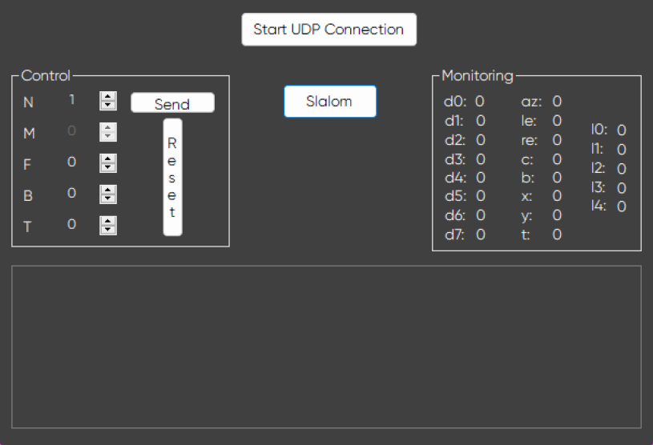
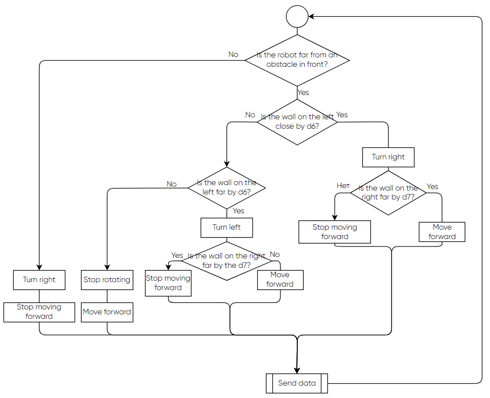
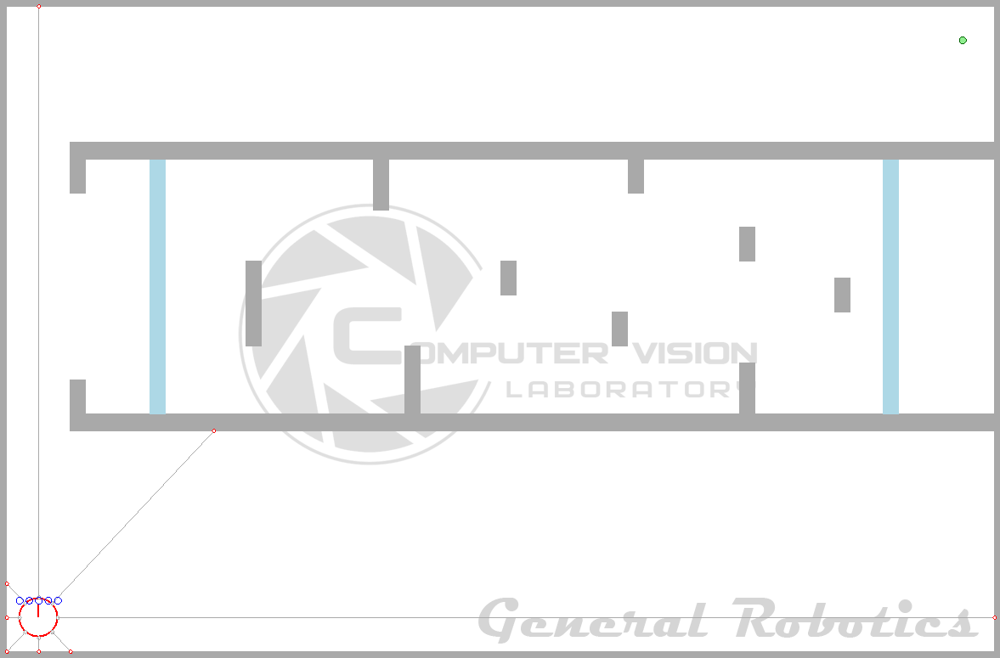
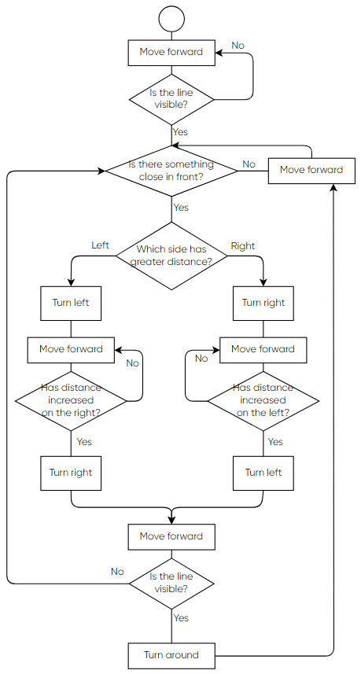

# C# Navigation

Three algorithms that perform navigation inside of the [IoT Robot World simulation](http://generalrobotics.ru/)

## Prerequisites

Requires .NET Framework >=4.8. Works only on Windows, sadly.

Download the simulator, start UDP connection, go to the simulation settings and change the map to the `map.txt` file. After the map has been changed, start the simulation and proceed to the Forms application.

Download the project

Choose one of the programs in the `Program.cs` by uncommenting the corresponding line:

```
// Application.Run(new Form1());
// Application.Run(new Form2());
// Application.Run(new Robocross());
```

Then, either add the project into your own VS solution or run it with command line command `dotnet run`

## Form1 aka slalom

Performs simple navigation around the walls by counting the sent commands.

<center></center>

`Start UDP Connection` button start connection with the simulator

The block `Control` contains message parameters that would be sent to the simulation via UDP as JSON strings.

- `N` is a number of the command
- `M` is always *0* due to the lack of support of other modes 
- `F` is a moving forward value (negative for moving backward), from -100 to 100
- `B` is a difference of movement between two wheels, right of which being the major, from -100 to 100
- `T` is always *0*, handling it is not implemented in the simulator yet

The block `Monitoring` contains information about the robot, such as values of its lidar beams (*d0*-*d7*) and values of the surface colour (*l0*-*l7*)

`Slalom button` just launches the main algorithm of going to the other end of the map.

- Move forward for 14 messages with a slight turn
- A sharper turn for 6 messages
- Move forward for 12 messages
- Sharp turn in the opposite direction for 5 messages
- Move forward for 8 messages
- Stop

Each message sets the motion for the robot for 1 second.

## Form2 aka move along the wall

This project is not so different from the first one, the Windows Form stays the same except for the name of the window and text on the start button being *Move*.

What *is* different, though, is that this projects involves using data from lidar rays for following the left wall (too far from the wall - turn to get closer), the algorithm for which is represented with a diagram:

<center></center>


## Robocross

The Windows Form again stays the same except for the name of the window and text on the start button being *Cross*.

Now, this project uses data from lidar rays, values of the surface's colour and robot's orientation in order to complete the map presented below.

<center></center>

The robot must start just beyond the leftmost blue line, move through the labyrinth, cross the second blue line and go back.

The algorithm for achieving this is, too, relatively simple and be better represented by a diagram:

<center></center>
